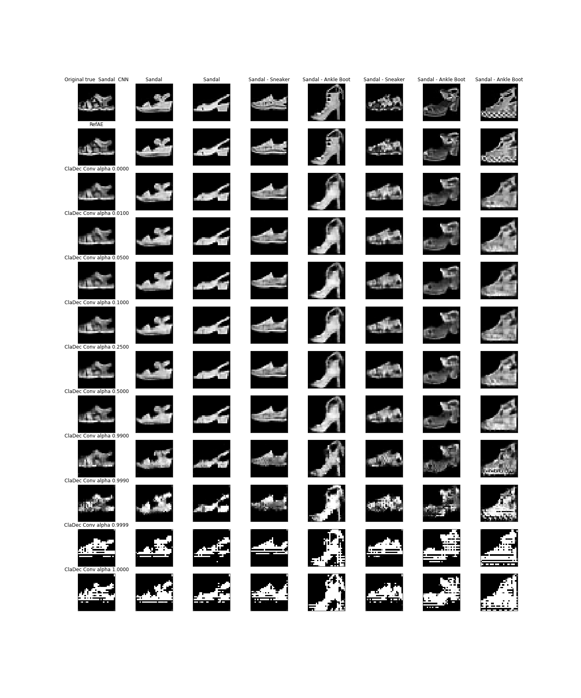

# cladec-mnist

An evaluation of the ClaDec architecture to explain layers of convolutional neural networks on the mnist digits and
fashion-mnist dataset.

## Introduction

The paper [Explaining Neural Networks by Decoding Layer Activations](https://arxiv.org/abs/2005.13630) by Johannes
Schneider and Michalis Vlachos introduces the `ClaDec` architecture.
ClaDec explains a layer of a NN by using the NN up to that layer as an encoder, and provides the latent representation
of
inputs in that layer as code for a decoder. The decoder then reconstructs inputs based on that code.

Reconstructed inputs are similar to the input domain and, therefore, easy to comprehend. Support is given in
the [extended version of the paper](https://www.semanticscholar.org/paper/Explaining-Classifiers-by-Constructing-Familiar-Schneider-Vlachos/9f8d136595ff962e81a83850612c13ebfeafa115#citing-papers)
by a user study.
To avoid the influence of the decoder part on the inputs recreated, a reference auto encoder with the same architecture
is used in addition. Only the differences between the reconstructions are the actual explanation of the layer.

ClaDec explanations for images are images. The explanation images should contain what the classifier uses to classify.
Concepts or aspects as textures, colors, shapes etc., which are in the ClaDec outputs, should resemble what information
the classifier
maintains and uses to get to a decision. They are important for the classifier. The explanations
are `through the eyes of AI`.
On the other hand, concepts which are not in the ClaDec outputs were not used by the classifier.

Created ClaDec models depend on the `alpha` parameter of the custom loss function. Please see `eq.1`
in [Explaining Neural Networks by Decoding Layer Activations](https://arxiv.org/abs/2005.13630).
The custom loss function is a linear combination between reconstruction and classification loss.
A low value of alpha means that the focus is on reconstruction. The explanations are more input like
with the goal that domain experts are able to derive insights. For a higher value of alpha the focus of the
decoder training is on the "inner life" of the classifier. Explanations should then resemble more
of the internals of the classifier. Thus, `alpha` provides a trade-off between comprehensibility and fidelity.

## Source Code

PyTorch code for the paper on the `VGG-11` architecture is on [GitHub](https://github.com/JohnTailor/ClaDec). It allows
evaluation on `Fashion-MNIST` `CIFAR-10` and `CIFAR-100` datasets. Training the neural networks requires dedicated
hardware.

This repository contains Keras code of an evaluation of `ClaDec` for a small VGG-like classifier architecture on
the `MNIST`
datasets. It is designed to run on a common laptop.

The source code for the creation of the classifier, reference auto encoder and ClaDec are given in `src`. The
script `create_models.py`
trains all models:

A classifier for each of the datasets, a ClaDec decoder for each value of `src.utils.ALPHAS` and each dataset, and a
Reference Auto Encoder for each dataset.
`ClaDec` and RefAE were created two times each. One time to explain a `Dense` layer and one time to
explain a `Convolutional` layer of the classifier.

The `ClaDec` class implementation in `src.cladec.py` can use different decoders for the training of ClaDec.
For the tests I used two dedicated decoders which were designed particularly for the two explained layers. Source code
is in `src.cladec_base.py`.

The architecture for explaining the `Dense` layer is as follows:

To explain the `Convolutional` layer the `Dense` and first `Convolutional Transpose` layer are dropped.

The reference auto encoder implementation simply copies the encoder and decoder of `ClaDec`. It starts with freshly
initialized weights and is trained on reconstruction loss only:

## Results

The final evaluation is given in the Jupyter Notebooks of `eval` dir.
Both classifiers (`MNIST` and `Fashion-MNIST`) achieve normal performance (categorical
accuracy `0.9905` and `0.8910`) on unseen data.
Evidence in data for the mean squared error and classification loss for each ClaDec and RefAE instance is shown
in `Evaluation-Performance.ipynb`. The actual explanations are in the `Evaluation-Layer` notebooks:

	- results of ClaDec for different values of alpha
		- similar agreement of alpha to reconstructions as in Figure 11
		- reconstructions worse than Figure 9 (for all tested alphas)
	- decoded the final dense layer - reconstructions really blurry, prototype like
	- decoded the last conv layer - reconstructions better but still prototype like
	- even for small values of alpha "strange" patterns only

The following image shows some explanations for `Fashion-MNIST` on the 128 neuron `Dense` layer of the classifier:

The reference auto encoder for `Fashion-MNIST` is not perfect. The reconstructions are a bit blurry and one needs to
compare the output of the ref auto encoder with ClaDec and the original image to derive insights.

Explanations of the `Convolutional` layer look more normal:

For `MNIST` reconstructions are better since the dataset is "easier". For the `Dense` layer one nevertheless sees
strange effects for higher `alpha`:

The reference auto encoder was able to reconstruct the `MNIST` images quite well. One therefore only
compares the output of ClaDec with the original images to derive conclusions.

For the `Convolutional` layer reconstructions are almost perfect:

Only for rather high `alpha` values some visual effects appear.

# Variational Decoder

work in progress

