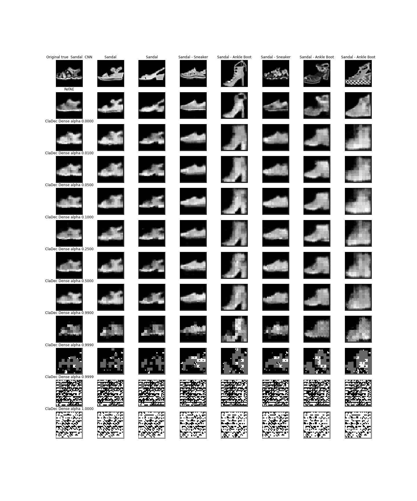
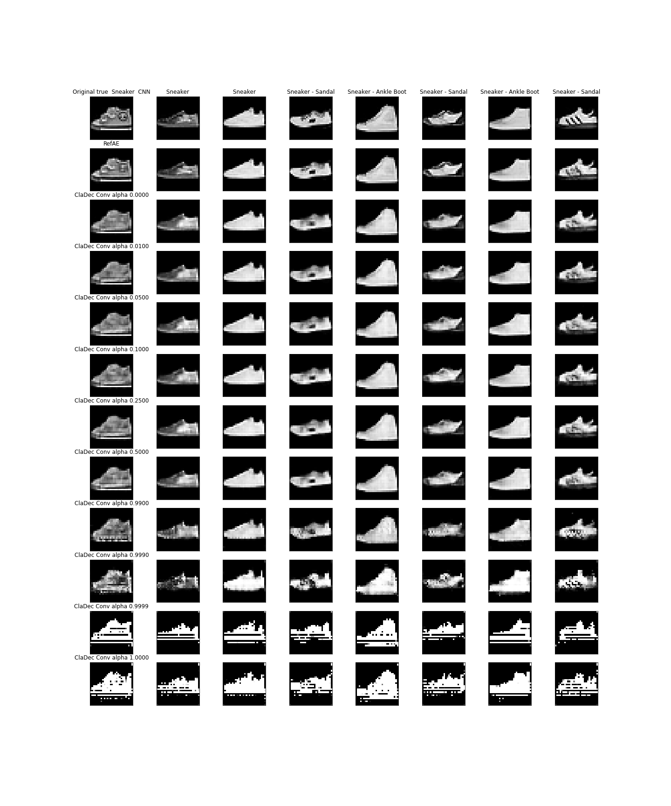
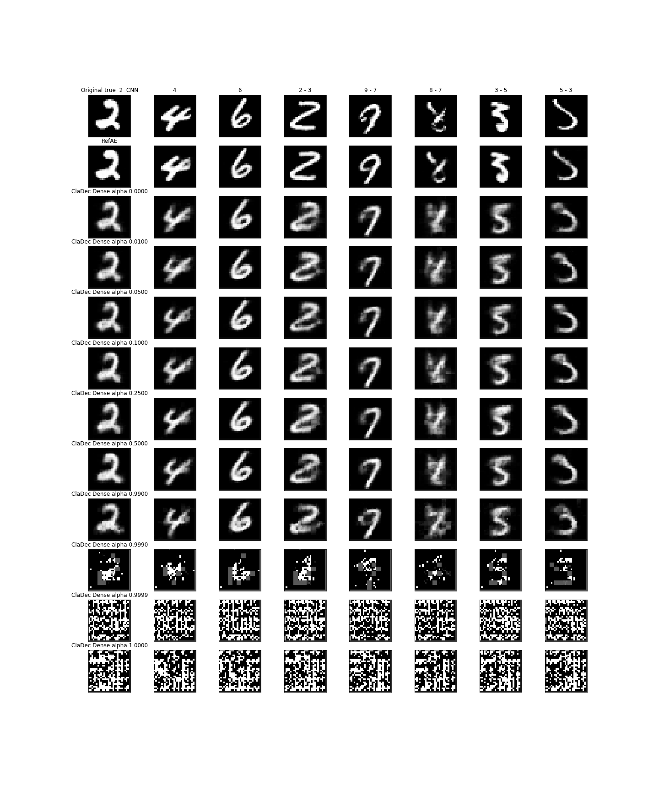
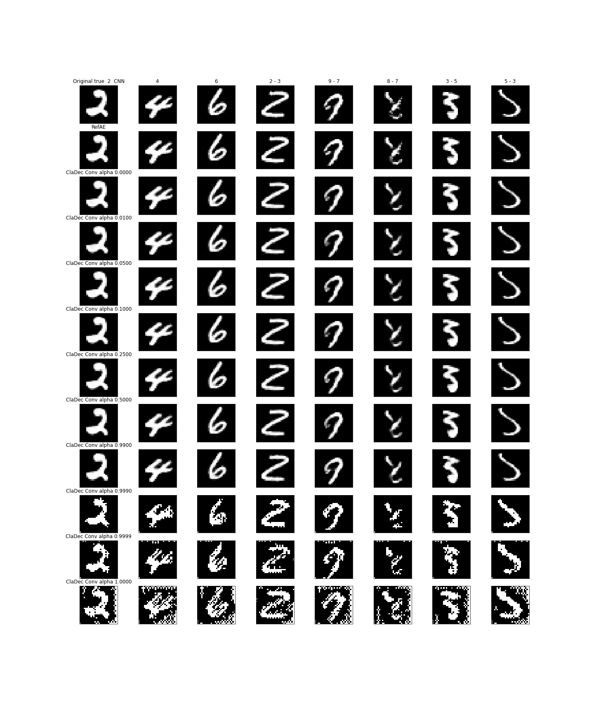

# cladec-mnist

An evaluation of the ClaDec architecture to explain layers of convolutional neural networks on the mnist digits and
fashion-mnist dataset.

## Introduction

The paper [Explaining Neural Networks by Decoding Layer Activations](https://arxiv.org/abs/2005.13630) by Johannes
Schneider and Michalis Vlachos introduces the `ClaDec` architecture.
ClaDec explains a layer of a NN by using the NN up to that layer as an encoder, and provides the latent representation
of inputs in that layer as code for a decoder. The decoder then reconstructs inputs based on that code.

Reconstructed inputs are similar to the input domain and, therefore, easy to comprehend. Support is given in
the [extended version of the paper](https://www.semanticscholar.org/paper/Explaining-Classifiers-by-Constructing-Familiar-Schneider-Vlachos/9f8d136595ff962e81a83850612c13ebfeafa115#citing-papers)
by a user study.
To avoid the influence of the decoder part on the inputs recreated, a reference auto encoder with the same architecture
is used in addition. Only the differences between the reconstructions are the actual explanation of the layer.

ClaDec explanations for images are images. The explanation images should contain what the classifier uses to classify.
Concepts or aspects as textures, colors, shapes etc., which are in the ClaDec outputs, should resemble what information
the classifier
maintains and uses to get to a decision. They are important for the classifier. The explanations
are `through the eyes of AI`.
On the other hand, concepts which are not in the ClaDec outputs were not used by the classifier.

Created ClaDec models depend on the `alpha` parameter of the custom loss function. Please see `eq.1`
in [Explaining Neural Networks by Decoding Layer Activations](https://arxiv.org/abs/2005.13630).
The custom loss function is a linear combination between reconstruction and classification loss.
A low value of alpha means that the focus is on reconstruction. The explanations are more input like
with the goal that domain experts are able to derive insights. For a higher value of alpha the focus of the
decoder training is on the "inner life" of the classifier. Explanations should then resemble more
of the internals of the classifier. Thus, `alpha` provides a trade-off between comprehensibility and fidelity.

## Source Code

PyTorch code for the paper on the `VGG-11` architecture is on [GitHub](https://github.com/JohnTailor/ClaDec). It allows
evaluation on `Fashion-MNIST` `CIFAR-10` and `CIFAR-100` datasets. Training the neural networks requires dedicated
hardware.

This repository contains Keras code of an evaluation of `ClaDec` for a small VGG-like classifier architecture on
the `MNIST`
datasets. It is designed to run on a common laptop.

The source code for the creation of the classifier, reference auto encoder and ClaDec are given in `src`. The
script `create_models.py`
trains all models:

A classifier for each of the datasets, a ClaDec decoder for each value of `src.utils.ALPHAS` and each dataset, and a
Reference Auto Encoder for each dataset.
`ClaDec` and RefAE were created two times each. One time to explain a `Dense` layer and one time to
explain a `Convolutional` layer of the classifier.

The `ClaDec` class implementation in `src.cladec.py` can use different decoders for the training of ClaDec.
For the tests I used two dedicated decoders which were designed particularly for the two explained layers. Source code
is in `src.cladec_base.py`.

The architecture for explaining the `Dense` layer is as follows:

To explain the `Convolutional` layer the `Dense` and first `Convolutional Transpose` layer are dropped.

The reference auto encoder implementation simply copies the encoder and decoder of `ClaDec`. It starts with freshly
initialized weights and is trained on reconstruction loss only:

## Results

The final evaluation is given in the Jupyter Notebooks of `eval` dir.
Both classifiers (`MNIST` and `Fashion-MNIST`) achieve normal performance (categorical
accuracy `0.9905` and `0.8910`) on unseen data.
Evidence in data for the mean squared error and classification loss for each ClaDec and RefAE instance is shown
in `Evaluation-Performance.ipynb`. The actual explanations are in the `Evaluation-Layer` notebooks:

### Explanations for Fashion MNIST

#### Dense Layer

The following image shows some explanations for `Fashion-MNIST` on the 128 neuron `Dense` layer of the classifier:

The reference auto encoder for `Fashion-MNIST` is not perfect. The reconstructions are a bit blurry and one needs to
compare the output of the ref auto encoder with ClaDec and the original image to derive insights. Some blurriness is the
effect of the chosen decoder architecture. However, the decoder is able to reconstruct images with details and
different grey values.

Explanations from the ClaDec decoder look more blurry and lack details. In fact, it only shows the general outlines
and not the textural details. The classifier seems to only look at the outline and does not rely on grey values.
This would explain why it classifies the sneakers incorrectly as Ankle Boot. The classifier cannot distinguish
between sneaker and ankle boot just by looking at the outline.

Some more examples on the classification of sandals:

The classifier seems to try to fit the input into some sort of learned prototype. This is particularly clear for the
wrong classification as sneakers.
It does not capture the necessary details of texture inside the sandals. It just takes the outline (general shape)
and
sees a sneaker. But there are some contradictions. Why does it classify the second sandal as correct. It seemed to got
at
least
some details here, which resulted in the darker are in the middle of the sandal.
The misclassified explanations again lack details of the inside of the shoes.Looking only at the outline makes it
difficult to distinguish between a high sandal and an ankle boot.

### Effects of alpha

The images greatly visualize the effect of alpha. For `alpha=0.0` the focus is on reconstruction, and it is easy to
compare the explanations with the original ones. This is also possible for a low value of alpha, and sometimes
there are darker areas which could highlight what area the classifier finds interesting for prediction (see e.g. sandals
for
0.05).

For `alpha=0.25` it is difficult to actually see a shoe in the images. The outputs are formed by small rectangles with
different
grey values being scattered over the outline of the original shoe. Interestingly the reconstructions of `alpha=0.5` do
not contain
many grey values again. The outputs seem to reflect the effects of striding and pooling in the convolutional layers.

A high value of alpha (e.g. 0.99) creates strange patterns. It has nothing to do with a shoe, and areas which are not
even
used in the original input are turned white or vice versa. However, same classes seem to produce similar patterns.

For my small network the influence of `alpha` on the reconstruction seems to be very high: Even for small values
of `alpha` reconstructions have many visual effects and the reconstructions are worse. The results of Figure 11
in [extended version of the paper](https://www.semanticscholar.org/paper/Explaining-Classifiers-by-Constructing-Familiar-Schneider-Vlachos/9f8d136595ff962e81a83850612c13ebfeafa115#citing-papers)
are the opposite: Even for very high `alpha` reconstructions look quite good. This is likely due to the
larger network size of the decoder that they used.

### Convolutional Layer

Explanations for the `Convolutional` layer:

The decoded images from the last convolutional layer seem to contain way more information than the ones from the dense
layers.
Shoes still contain details such as
textures and different grey values. This is the case for the reference AE as well. From this we could derive that
the information loss occurs in the `Dense` layer, or, that the convolutional layers were not much adjusted for the
classification task:
If the classifier would focus on particular learned features in the kernels we should see only those in the
reconstructions. But it could be that the classifier uses only some kernels, and altogether the kernels still have the
information.

For the convolutional layer the influence of alpha is quite similar, but one needs a higher value to produce the same
effects.
Even high values still somewhat resemble the original image.

### Explanations for MNIST

For `MNIST` reconstructions are overall better since the dataset is "easier".
The reference auto encoder was able to reconstruct the `MNIST` images quite well. One therefore only
compares the output of ClaDec with the original images to derive conclusions.

#### Dense Layer

ClaDec generated images for the correctly classified images are quite good. The classifier seems to be quite certain.
For the wrongly classified images reconstructions are worse which hints to the uncertainty of the classifier.
Blurry regions appear particularly in regions which would be important to distinguish the digits (e.g. comparing the 9
which was classified as a 4).
A low `alpha` seems to produce explanations which show what the classifier actually "saw". For instance, reconstructions
for alpha between `0.05` and `0.25` for the 9 which was classified as 5 visualize a 5.

For `alpha=0.5` one sees prototypical digit shapes. The classifier learned certain prototypical areas.
For example, there are similar patterns for the images classified as 4. We see similar patterns for the
5 and the incorrectly classified 9. For the digit 7 it is contra-intuitive since
the prototypical instance looks like a 7 but the classifier classified it incorrectly as a 1.

For the `Convolutional` layer reconstructions are almost perfect:

Only for higher `alpha` values some visual effects appear, but they are not any different between correctly and
wrongly classified digits. One is not able to derive insights why the classifications were wrong.

# Variational Decoder

work in progress:

Can ClaDec be extended to derive global insights about the classifier by using a variational decoder?

A first trial gave some prototypical forms from ClaDec:

This is to be compared to a reference variational auto encoder:

